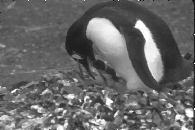
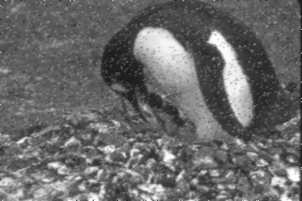
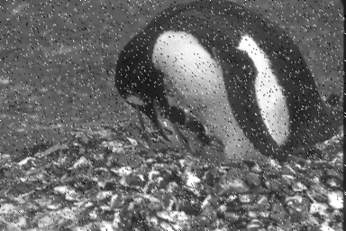
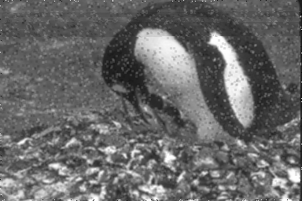

# Processador de imagens
Projeto feito no fim da disciplina de algoritimos e programação


## 🚀 Início rápido

1. **Clonar o repositório**  
  Use o comando a seguir para isso
```shell
git clone https://github.com/jpalvesl/processador-de-imagem.git
```

2. **Navegue até a pasta com os arquivos fonte**  
  ```shell
  cd src/
  ```

3. **Baixe as bibliotecas com os comandos a seguir**  
  ```shell
  pip3 install opencv-python
  pip3 install matplotlib
  ```

4. **Execute o main** 
  ```shell
  python3 Projeto-finalizado
  ```

# 🧐 O que é usado?
- opencv
- matplotlib

## Exemplos de uso
### Imagem Original
  

### Filtro da Mediana 
  

### Filtro da Media 
  

### Filtro da Kuwahara 3x3
  

### Filtro da Kuwahara 5x5
  
